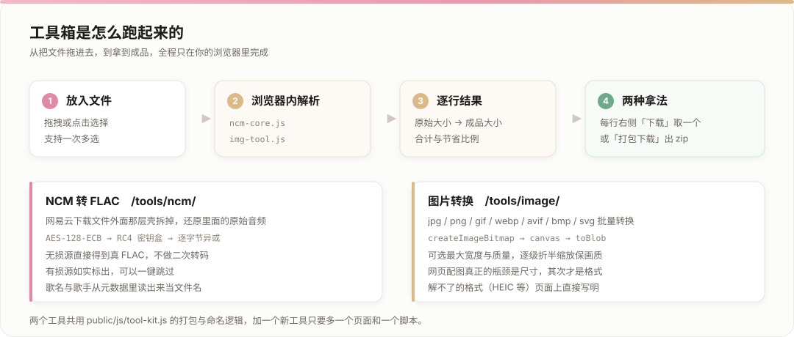
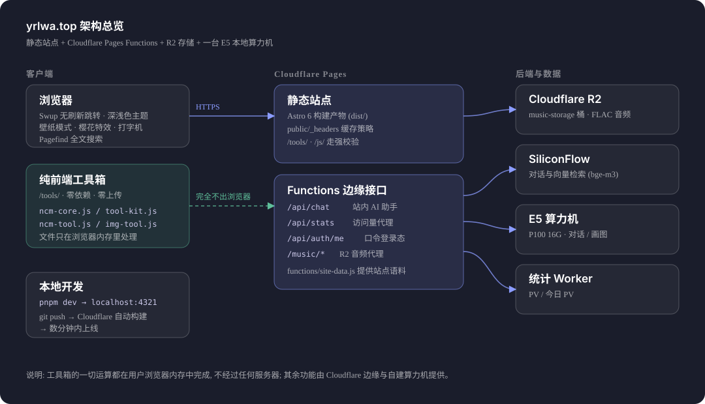

# yRlwAaa

> 私の小さな部屋へようこそ


[](https://yrlwa.top/)
[](https://astro.build/)
[](https://www.typescriptlang.org/)
[](https://nodejs.org/)
[](https://pnpm.io/)
[](https://pages.cloudflare.com/)

这是我的个人站 **yrlwa.top**（始于 2026-04-30）的完整源码。写文章、记日记、放音乐、追番、看设备，外加几个自己写的纯前端小工具——所有数据都在这个仓库里，推上去 Cloudflare 会自动构建上线。

---

## 🗺️ 站点地图

| 导航 | 内容 |
|:--|:--|
| **首页 / 归档** | 文章列表（支持列表/卡片切换、分类栏）、按时间归档 |
| **Links** | Bilibili、GitHub、Twitch |
| **My** | Anime 追番 · Diary 日记 · Gallery 相册 · 音乐 · Devices 设备 · **服务器** · **工具** |
| **About** | 关于我 · 友链 |
| **Others** | Projects · Skills · Timeline · 词典 |

> 加粗的「服务器」「工具」以及 Devices、音乐、词典都是这个站自己加的，详见下面的 [这个站有什么](#-这个站有什么)。

---

## ✨ 这个站有什么

### 🧰 工具箱

自己写的，**纯前端零依赖**：拖进去、点一下、拿走成品，文件从头到尾不离开浏览器，也不上传任何服务器。



**① NCM 转 FLAC** —— `/tools/ncm/`

网易云 `.ncm` 是给下载文件套的一层加密容器，里面装的就是原始音频流。这个工具把壳拆掉，直接吐出原始 FLAC，**不做二次转码**，音质和源文件逐字节一致：

```text
每字节 XOR 0x64 → AES-128-ECB 解密 → 去掉 PKCS7 填充
                → 砍掉 17 字节 "neteasecloudmusic" → 得到 RC4 密钥
音频部分:  明文[i] = 密文[i] ^ 密钥流[(i + 1) & 0xff]
```

- 标题、歌手、专辑从 meta 区解出来，输出名自动变成 `歌手 - 歌名.flac`
- 不盲信文件里声明的格式，按解密后数据的魔数（`fLaC` / `ID3` / `OggS` …）判断真实格式并如实标注，有损源可一键跳过
- 可选附带专辑封面

**② 图片转换** —— `/tools/image/`

jpg / png / gif / webp / avif / bmp / svg → WebP / PNG / JPEG / AVIF，可选**最大宽度**与**质量**。

- 网页配图真正的瓶颈是尺寸不是格式：一张 4000px 的照片缩到 1600px 往往就省掉九成体积
- 编码能力运行时探测（`canvas.toBlob` 对不支持的格式会静默回退成 PNG，只认返回 blob 的 `type`）
- 逐级折半缩放避免锯齿；自动处理 EXIF 方向；转 JPEG 先铺白底；SVG 无固有尺寸时按 viewBox 推算
- 大图 / iPhone 的 HEIC / 动图 GIF 这些解不了的，页面上直接写明，不装作支持

**两个工具共用的东西**：`public/js/tool-kit.js`（CRC32、仅存储模式的 ZIP 打包、文件名清洗），结果列表每行显示「原始大小 → 成品大小」，底部给合计与节省比例；每行右侧可以单独下载，也可以一键打包成 zip（**不点就不打包**，不占内存）。

### 🤖 站内 AI 助手

右下角悬浮窗里的对话助手，可以问「这个站都有什么文章」「某篇讲了什么」这类问题。

- 前端：`src/components/ai-assistant/AIAssistant.svelte`，挂在 `FloatingControls.astro`，每轮带 sessionId，刷新即新会话（不持久化聊天记录）
- 后端：`functions/api/chat.js`（Cloudflare Pages Functions），会话与消息存在 **Cloudflare D1**，回答走 SiliconFlow 的对话接口
- 检索：构建期用 `scripts/build-site-index.mjs` 把全部文章切成语料并生成向量索引（`bge-m3`）产出 `public/site-index.json`、`public/site-guide.json`，线上按问题检索相关段落再喂给模型；问到「全部 / 每章 / 全站」这类概览问题时改走全站摘要

### 🖥️ 服务器控制台

`/server/` 是一个自建的算力机面板，把一台 E5 + P100 16G 的机器当成家用小机房来管：

- 实时显示 GPU 显存/负载/温度、CPU、内存、各磁盘占用
- 一键切换**对话 AI**（Qwen 27B · llama.cpp · 11435）与**画图**（SD WebUI · 7860）——两者显存冲突，所以启动一个会自动停另一个
- 唤醒（WoL）、全部停止、编译/终端入口
- 控制类操作需要口令，访客只能看数据不能操作

### 🎵 音乐馆

- 专辑墙 + 艺人页 + 专辑详情（`/music/`、`/music/artist/[id]`、`/music/album/[id]`）
- 元数据单一来源 `src/data/music.json`（艺人 / 专辑 / 曲目），当前 2 位艺人、4 张专辑、52 首曲目
- 音频不放在仓库里，托管在 **Cloudflare R2**（`music-storage` 桶），由 `functions/music/_path.js` 代理 `/music/*` 请求，带上 `audio/flac` 类型、一天缓存与下载头
- 页面上还有个 Meting 歌单播放器（网易云歌单），支持浮动小窗与侧边栏两种形态

### 📚 内容页面

| 页面 | 说明 | 数据来源 |
|:--|:--|:--|
| Anime | 追番进度与评分 | Bilibili（vmId `381710006`）自动抓取 |
| Diary | 日记 / 动态流 | `src/data/diary.ts` |
| Gallery | 相册（构建期扫描目录生成） | `public/images/albums/<相册名>/info.json` |
| Devices | 设备收藏展示 | `src/data/devices.ts` |
| Projects | 项目展示 | `src/data/projects.ts` |
| Skills | 技能树 | `src/data/skills.ts` |
| Timeline | 人生时间线 | `src/data/timeline.ts` |
| 词典 | 英语词典 + 翻译（调免费词典 / 翻译接口） | `src/pages/dictionary.md` |

### 🎨 界面与体验

- 明暗主题 + 主题色相可调（`hue` 240），跟随系统偏好
- 多种壁纸模式（横幅 / 全屏壁纸 / 关闭），桌面与移动端各一套横幅轮播
- 樱花飘落、波浪、页面切换过渡（Swup 无刷新跳转，导航栏与播放器常驻不重载）
- 字体：ASCII 用 Zen Maru Gothic、中文用萝莉体，构建时自动子集压缩
- 悬浮目录 / 侧边目录 / 移动端顶部目录，日式编号徽章
- 阅读进度条、最后修改时间、分享按钮、页面翻译（client.edge）
- 侧边栏组件：个人资料、天气、公告、音乐、分类、标签、目录卡、站点统计、日历

### 🔍 内容能力

- **Pagefind** 全文搜索
- **Expressive Code** 代码块（行号、折叠、语言徽章）
- **KaTeX** 数学公式、**Mermaid** 图表
- Callout 提示块、GitHub 仓库卡片、图片画廊（PhotoSwipe）
- **文章加密**：frontmatter 写 `encrypted: true` + `password`，小说章节就是这么放的
- RSS / Atom、Sitemap、SEO meta

---

## 🏗️ 架构



| 层 | 用什么 |
|:--|:--|
| 前端 | Astro 6 + Svelte + Tailwind CSS v4，静态输出 |
| 边缘接口 | Cloudflare Pages Functions（`functions/`） |
| 对象存储 | Cloudflare R2（音乐音频） |
| 模型服务 | SiliconFlow（对话 + 向量检索） |
| 自建算力 | 一台 E5 + P100 16G 的机器，跑对话与画图 |
| 统计 | 自建统计 Worker，经 `/api/stats` 代理 |

### 仓库结构

```text
src/
├── config.ts            站点总配置（导航 / 横幅 / 侧边栏 / 个人资料）
├── data/                数据源（音乐、设备、项目、技能、日记、工具清单…）
├── pages/               页面路由
│   ├── tools/           工具箱（列表页 + 每个工具一个页面）
│   ├── server.astro     服务器控制台
│   ├── music/           音乐馆（专辑 / 艺人 / 详情）
│   └── api/             构建期与运行期的 JSON 接口
├── components/          组件（含 ai-assistant、devices 等自建件）
├── content/posts/       文章正文
└── styles/              全局样式与主题变量
public/
├── js/                  纯前端工具脚本（tool-kit / ncm / img …）
├── images/albums/       相册数据，每个相册一个 info.json
├── music/albums/        专辑封面
└── _headers             缓存策略
functions/               Cloudflare Pages Functions（边缘接口）
scripts/                 构建期脚本（天气、站点索引、字体压缩…）
docs/image/              README 用图
```

---

## 🚀 本地开发与部署

```bash
# 1. 装依赖
pnpm install

# 2. 起本地开发服务器
pnpm dev          # → http://localhost:4321

# 3. 构建产物
pnpm build        # → ./dist
```

`pnpm build` 并不只是 `astro build`，它按顺序跑：

```text
fetch-weather → build-site-index → build-site-data → update-anime
→ astro build → pagefind (全文索引) → compress-fonts (字体子集)
```

**部署**：仓库连在 Cloudflare Pages 上，`master` 一推就自动构建上线，构建命令 `pnpm build`、输出目录 `dist`。

- `functions/` 里的每个文件对应一条边缘接口，随 Pages 一起部署
- `public/_headers` 管缓存策略（`_astro`、`assets`、图片等长缓存；`/tools/`、`/js/` 强校验，改了立刻生效）
- 环境变量（如 SiliconFlow 的 key、R2 绑定）在 Cloudflare Pages 后台配置，不要提交 `.env`

---

## 📝 写作与内容维护

### 文章 frontmatter

```yaml
---
title: 标题
published: 2026-09-20
description: 摘要（写了它，列表里就不显示日期了）
image: ./cover.jpg        # 封面
tags: [标签]
category: AI              # 分区
draft: false
pinned: false
comment: false
encrypted: false          # 加密文章
password: "..."           # 配合 encrypted 使用
---
```

**分区**不用改代码：`src/utils/content-utils.ts` 的 `getCategoryList()` 会从所有文章的 `category` 字段动态派生，加一篇带新 category 的文章就自动多一个分区。现有分区：`小说`（11 章）、`AI`、`杂记`，以及主题示例留下的 `Examples`、`Technology`、`Front-end`、`Guides`。

**置顶**排序规则（`getRawSortedPosts()`）：

1. `pinned: true` 的排最前
2. 同为置顶时，`priority` 数值小者靠前（都没写就跳过这级）
3. 其余按 `published` 降序

### 想改什么，改哪个文件

| 想改的东西 | 去哪改 |
|:--|:--|
| 站点标题 / 副标题 / 主题色 / 横幅 / 首页打字机文案 | `src/config.ts` |
| 导航栏结构 | `src/config.ts` 的 `navBarConfig.links` |
| 侧边栏组件与顺序 | `src/config.ts` 的 `sidebarLayoutConfig` |
| 个人资料与社交链接 | `src/config.ts` 的 `profileConfig` |
| 音乐专辑 / 艺人 / 曲目 | `src/data/music.json`（音频另传 R2） |
| 设备展示 | `src/data/devices.ts` |
| 项目 / 技能 / 时间线 / 日记 / 友链 / 追番 | `src/data/` 对应文件 |
| **工具箱条目** | `src/data/tools.ts`（加一条就多一个工具） |
| 工具页样式与结构 | `src/pages/tools/<id>/index.astro` |
| 工具实现 | `public/js/<id>-tool.js`（公共逻辑放 `tool-kit.js`） |
| 服务器面板 | `src/pages/server.astro` |

### 加一个新工具（三步）

1. `src/data/tools.ts` 的 `toolsData` 里加一条（id / 名称 / 简介 / 图标 / url）——列表页会自动多出一行
2. 建 `src/pages/tools/<id>/index.astro`（注意 `trailingSlash: always`，必须用目录形式）
3. 写 `public/js/<id>-tool.js`，页面底部用 `<script is:inline src="...">` 引入；改了脚本记得把页面里的 `?v=` 和脚本里的 `VER` 一起 +1

---

## ⚡ 常用命令

| 命令 | 作用 |
|:--|:--|
| `pnpm dev` | 本地开发（`localhost:4321`） |
| `pnpm build` | 完整构建到 `./dist` |
| `pnpm preview` | 本地预览构建产物 |
| `pnpm check` | Astro 类型与语法检查 |
| `pnpm type-check` | TypeScript 类型检查 |
| `pnpm lint` | ESLint 检查并修复 |
| `pnpm format` | Prettier 格式化 |
| `pnpm new-post <文件名>` | 新建文章 |
| `pnpm update-anime` | 更新追番数据 |
| `pnpm update-bilibili` | 更新 B 站数据 |
| `pnpm update-bangumi` | 更新 Bangumi 数据 |
| `pnpm compress-fonts` | 字体子集压缩 |
| `pnpm submit` | 向 IndexNow 提交站点 URL |
| `pnpm sync-content` | 同步外部内容仓库（可选） |

---

## 🧯 踩过的坑

**改了页面刷不出来？** 先看 `public/_headers`：`*.html` 是 `max-age=3600`，浏览器会把页面缓存一小时，普通 F5 会直接命中缓存。`/tools/*` 和 `/js/*` 已经改成强校验，其余页面强刷 `Ctrl + Shift + R` 即可。排查顺序：先确认代码真的推上去了（`git grep 特征 <已推送的commit>`）→ 再看浏览器拿到的是不是旧文件 → 再查缓存头 → 最后才怀疑构建失败。

**`astro build` 报 `spawn EPERM`？** 那是受限环境禁止子进程管道导致的（Vite 在 Windows 上会执行 `net use`，esbuild 也要起子进程），不是项目问题，换普通终端跑。

**构建卡住或失败？** `pnpm build` 里 `VisitorStatsPro` 会在构建期请求统计 Worker，那个接口不通时整个构建会挂；同理 `fetch-weather`、`update-anime` 也都依赖外网。构建失败先看是不是这几个外部请求的锅。

**ZIP 里的中文名乱码？** 打包用的存储模式 ZIP 已写入 UTF-8 文件名标志位，Windows 资源管理器与 `Expand-Archive` 都正常；老解压软件可能不认这个标志。

**仓库里那套 Vercel / GitHub Pages 配置还算数吗？** 不算。`vercel.json`、`.github/workflows/deploy.yml` 都是历史遗留，实际部署路径只有 Cloudflare Pages 一条，改缓存和头规则看 `public/_headers`。

---

## 🙏 致谢

本站基于开源主题 **[Mizuki](https://github.com/LyraVoid/Mizuki)** 二次开发，主题本身又源自 **[Fuwari](https://github.com/saicaca/fuwari)**，并参考了 [Yukina](https://github.com/WhitePaper233/yukina)、[Firefly](https://github.com/CuteLeaf/Firefly)、[Twilight](https://github.com/spr-aachen/Twilight) 的设计。感谢这些作者把东西开源出来。

其余使用到的开源项目：[Astro](https://astro.build)、[Tailwind CSS](https://tailwindcss.com)、[Swup](https://swup.js.org)、[Pagefind](https://pagefind.app)、[Expressive Code](https://expressive-code.com)、[KaTeX](https://katex.org)、[PhotoSwipe](https://photoswipe.com)、[Iconify](https://iconify.design)、[Pio](https://github.com/Dreamer-Paul/Pio)。

## 📄 许可

本仓库代码遵循 [Apache License 2.0](./LICENSE)；上游 Fuwari 的 MIT 许可声明保留在 [LICENSE.MIT](./LICENSE.MIT)。

站点内的文章、图片、音乐等原创内容版权归作者所有，未经允许请勿转载；标注来源的内容版权归原作者所有。
